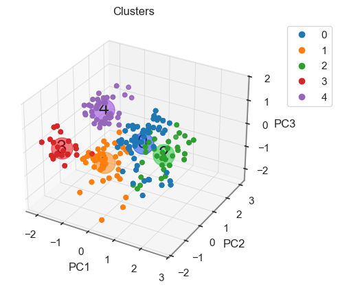
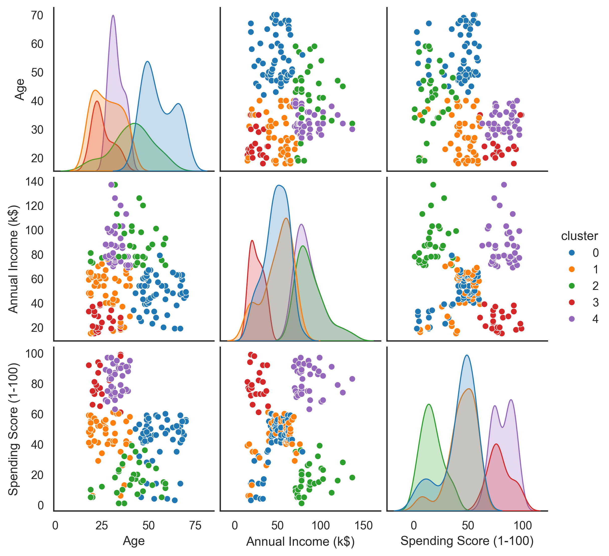
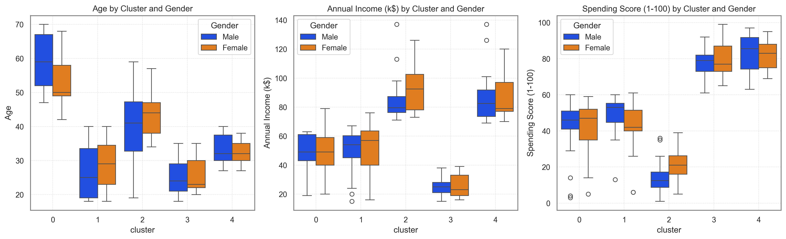

# 🛍️ Segmentação de Clientes de um Supermercado

Este projeto aplica técnicas de aprendizado não supervisionado para segmentar clientes de um supermercado com base em variáveis demográficas e comportamentais obtidas via cartões de fidelidade. As informações incluem idade, gênero, renda anual e uma pontuação de gastos atribuída conforme o padrão de compras.

O objetivo é identificar diferentes perfis de consumidores, oferecendo subsídios para estratégias de marketing mais personalizadas e eficientes.

> 📂 [Link para o dataset no Kaggle](https://www.kaggle.com/vjchoudhary7/customer-segmentation-tutorial-in-python)

---

## 🎯 Objetivos

O projeto tem como foco demonstrar, de forma prática e didática, como aplicar técnicas de clusterização para segmentar clientes. Em um cenário real, esses agrupamentos auxiliam empresas a entender melhor seu público e tomar decisões orientadas por dados.

### Objetivos específicos:

- Comparar os resultados da clusterização **com e sem pré-processamento**, destacando sua importância.
- Apresentar a **estrutura de um projeto de Ciência de Dados**: notebooks, scripts, relatórios e versionamento via GitHub.
- Demonstrar boas práticas de **programação em Python**, com uso de funções reutilizáveis.
- Aplicar recursos avançados do **Scikit-Learn**, como `pipelines` e `PCA` para redução de dimensionalidade.

---

## 🗂️ Estrutura do Repositório

- **Data/**: contém os dados brutos, incluindo o `Mall_Customers.csv`.
- **Reports/Images/**: gráficos e figuras usadas no projeto e no README.
- **Models/**: pipelines e modelos `.pkl` treinados.
- **Scripts/**: notebooks e arquivos auxiliares:
  - `code_0_initial_exploration.ipynb`: visualização inicial + limpeza.
  - `code_1_no_pipeline_clustering.ipynb`: clusterização sem pré-processamento (didática).
  - `code_2_final_analysis.ipynb`: pipeline com `StandardScaler`, `PCA` e `KMeans`.
  - `functions.py`: funções auxiliares reutilizadas.
  - `config.py`: caminhos e constantes globais.

---

## 📑 Sobre o Dataset

O dataset original [`Mall_Customers.csv`](Data/raw/Mall_Customers.csv) contém os seguintes campos:

- `CustomerID`: identificador único do cliente
- `Gender`: gênero
- `Age`: idade
- `Annual Income (k$)`: renda anual (milhares de dólares)
- `Spending Score (1–100)`: pontuação de gastos atribuída pelo supermercado

---

## 📈 Resultados dos Clusters

- **Data/**: contém os dados brutos, incluindo o `Mall_Customers.csv`.
- **Reports/Images/**: gráficos e figuras usadas no projeto e no README.
- **Models/**: pipelines e modelos `.pkl` treinados.
- **Scripts/**: notebooks e arquivos auxiliares:
  - `code_0_initial_exploration.ipynb`: visualização inicial + limpeza.
  - `code_1_no_pipeline_clustering.ipynb`: clusterização sem pré-processamento (didática).
  - `code_2_final_analysis.ipynb`: pipeline com `StandardScaler`, `PCA` e `KMeans`.
  - `functions.py`: funções auxiliares reutilizadas.
  - `config.py`: caminhos e constantes globais.

---

## 📑 Sobre o Dataset

O dataset original [`Mall_Customers.csv`](Data/raw/Mall_Customers.csv) contém os seguintes campos:

- `CustomerID`: identificador único do cliente
- `Gender`: gênero
- `Age`: idade
- `Annual Income (k$)`: renda anual (milhares de dólares)
- `Spending Score (1–100)`: pontuação de gastos atribuída pelo supermercado

---

## 📈 Resultados dos Clusters

Com o pipeline completo (pré-processamento + PCA + KMeans), foram identificados **5 clusters** com perfis distintos:

| Cluster | Pontuação de Gastos | Renda    | Idade    |
|---------|---------------------|----------|----------|
| 0       | Moderada            | Moderada | Alta     |
| 1       | Moderada            | Moderada | Jovem    |
| 2       | Baixa               | Alta     | Moderada |
| 3       | Alta                | Baixa    | Jovem    |
| 4       | Alta                | Alta     | Jovem    |

---
